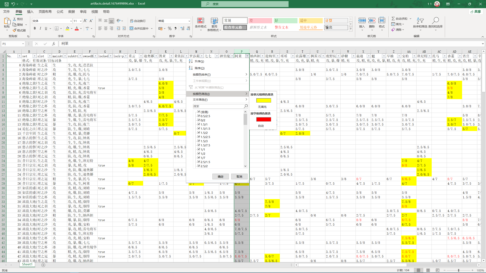

# 狗粮筛选器 #

基于yas导出格式的圣遗物胚子筛选脚本。

## 0. 脚本依赖：

* [Ruby](https://www.ruby-lang.org/)环境。纯Windows可以从[这里](https://rubyinstaller.org/)下载安装包。WSL直接用命令行安装，比如：

    * Ubuntu
    ```
    sudo apt install ruby-full
    ```

    * Fedora
    ```
    sudo dnf install ruby
    ```

    * Arch
    ```
    sudo pacman -Sy ruby
    ```
* [write_xlsx](https://cxn03651.github.io/write_xlsx/):

    ```
    gem install -N write_xlsx
    ```

## 1. 运行方式：

* 下载压缩包解压并进入目录，shift+右键空白处选择`在此处打开Linux Shell`或`在此处打开Powershell`(取决于Ruby安装方式)。
* 返回资源管理器，进入yas目录，右键`以管理员权限运行` `yas-lock.exe`以生成圣遗物文件。
* 返回命令行窗口，键入`ruby main.rb`并回车执行以生成lock文件。(添加`-f`参数可以重新判断已锁定圣遗物)
* 返回资源管理器，再次运行`yas-lock.exe`以锁定圣遗物。
* 运行完成后可在`yas/artifacts.detail.{timestamp}.xlsx`里复查结果。

## 2. 结果示例：

* 可以通过`lock-pending`列快速筛选需要锁定的圣遗物。
* 可以通过`颜色筛选`快速筛选适配圣遗物。
* 着色文本代表圣遗物有效词条数达标，着色背景代表所属套装适配当前人物。

## 2. 运行规则：

* `config/artifacts_config.json`按部位和主词条定义了有效副词条数下限：
    * 小攻击小防御小生命计0.5词条，其余计1词条。
    * least_xx_yy：套装正确时xx部位以yy为主词条的胚子的有效副词条下限。低于此数值的胚子将被舍弃。
    * subleast_xx_yy: 用作散件时xx部位以yy为主词条的胚子的有效副词条下限。低于此数值的胚子将被舍弃。
    * allow_nonset_on_flower: 花毛允许使用散件，默认false。
    * allow_substitution: 允许下位替代，比如需求属伤杯时攻击杯也有效。
* `config/{lang}.artifacts_equip.csv`定义了人物需求的属性：
    * elem: 主要伤害类型，七元素+物理，影响属伤杯的选择，为空则无需属伤杯。
    * mainAttr, mainAttr2: 有效主属性，影响副属性和下位替代属性。
    * subAttr: 有效副属性，计有效副词条但不可用作主属性。
    * mainAttr, mainAttr2, subAttr只能在攻防生精中选择。
    * ER: 是否刚需充能。2-可选充能沙，1-只靠副词条歪充能，0-充能为无效词条，-1-完全舍弃大招。
    * CR: 是否需要暴击。3-需要暴击爆伤，2-只需要爆伤，1-只需要暴击，0-无需暴击，-1-需要治疗头。
    * enable: 是否启用该行配置，不启用则置FALSE，或者直接删除该行也可。
* `yas/disabled_chars.txt`定义了禁用的人物，每行一个人物名，效果同上文enable列置false。
* 所有文件均以utf8编码保存，保存配置文件时请勿更改编码。编辑配置文件时建议使用[vscode](https://code.visualstudio.com/Download)或[notepad3](https://www.rizonesoft.com/downloads/notepad3/)保存。

## 3. Credits

* https://github.com/ideless/yas-lock
* https://nga.178.com/read.php?tid=27859119
